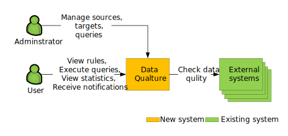
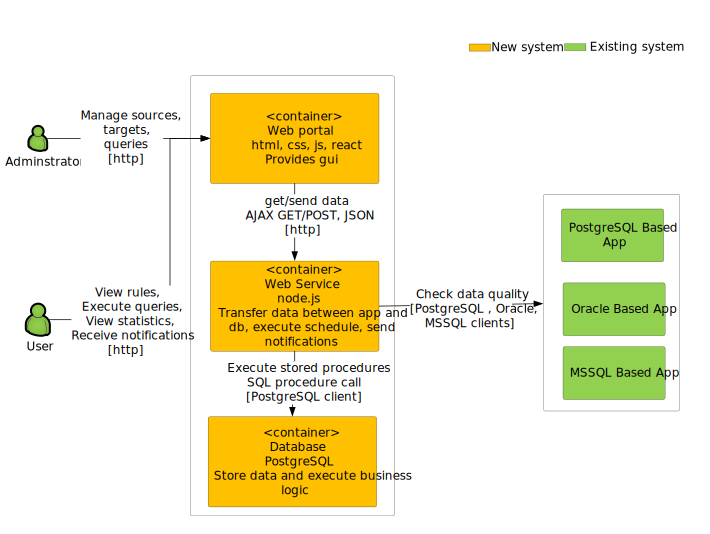

# Data Qualture
## Data quality tool

1. Allows you to automatically check your data quality.
2. Social. Each error has a responsible person.
3. Statistics and analytics.
4. Simple. Really simple.

Try demo at [https://data-quality.ru](https://data-quality.ru)

## Architecture
### Context Diagram

### Container Diagram

